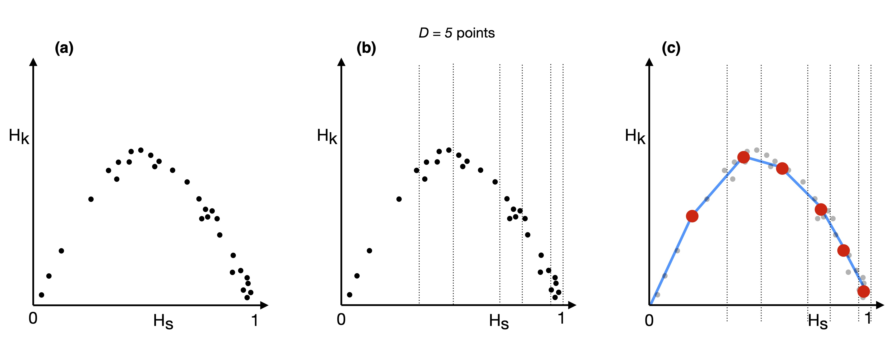

# Contents 

**[1 - Introduction](#1---introduction)** <br /><br />
**[2 - Requirements](#2---requirements)** <br /><br />
**[3 - Usage](#3---usage)**  <br /><br />
**[4 - remove_H_atoms.py](#4---remove_h_atomspy)** <br />
&emsp; [4.1 - Scope](#41---scope) 
&emsp;&emsp;&emsp; [4.2 - Requirements](#42---requirements) 
&emsp;&emsp;&emsp; [4.3 - Usage](#43---usage) 
&emsp;&emsp;&emsp; [4.4 - Arguments](#44---arguments)
&emsp;&emsp;&emsp; [4.5 - Output](#45---output)  <br /><br />
**[5 - ResRel-MPI.py](#5---resrel-mpipy)** <br />
&emsp; [5.1 - Scope](#51---scope)
&emsp;&emsp;&emsp; [5.2 - Requirements](#52---requirements)
&emsp;&emsp;&emsp; [5.3 - Usage](#53---usage)
&emsp;&emsp;&emsp; [5.4 - Arguments](#54---arguments)
&emsp;&emsp;&emsp; [5.5 - Output](#55---output)  <br /><br />
**[6 - Hs-Hk-plot.py](#6---hs-hk-plotpy)**  <br />
&emsp; [6.1 - Scope](#61---scope)
&emsp;&emsp;&emsp; [6.2 - Tasks](#62---tasks) 
&emsp;&emsp;&emsp; **[6.3 - "Density" Task](#63---density-task)**
&emsp;&emsp;&ensp; **[6.4 - "Bin" Task](#64---bin-task)**
&emsp;&emsp;&emsp; [6.5 - Output](#65---output)<br />
&emsp;&emsp;&emsp;&emsp;&emsp;&emsp;&emsp;&emsp;&emsp;&emsp;&emsp;&emsp;&emsp;&emsp;&emsp;&emsp;&emsp;&emsp;&nbsp;&thinsp; [6.3.1 - Requirements](#631---requirements)
&emsp;&emsp;&nbsp;&nbsp;&thinsp;&thinsp; [6.4.1 - Requirements](#641---requirements)  <br />
&emsp;&emsp;&emsp;&emsp;&emsp;&emsp;&emsp;&emsp;&emsp;&emsp;&emsp;&emsp;&emsp;&emsp;&emsp;&emsp;&emsp;&emsp;&nbsp;&thinsp; [6.3.2 - Usage](#632---usage) 
&emsp;&emsp;&emsp;&emsp;&emsp;&emsp; [6.4.2 - Usage](#642---usage) <br />
&emsp;&emsp;&emsp;&emsp;&emsp;&emsp;&emsp;&emsp;&emsp;&emsp;&emsp;&emsp;&emsp;&emsp;&emsp;&emsp;&emsp;&emsp;&nbsp;&thinsp; [6.3.3 - Arguments](#633---arguments) 
&emsp;&emsp;&emsp;&emsp; [6.4.3 - Arguments](#643---arguments) <br />


# 1 - Introduction
When coarsening biomolecules, the identification of the optimal number of sites to minimize information loss from an all-atom conformation is a challenging task. Several coarse-grained and multi-resolution models have been developed to tackle this issue, and one promising model is CANVAS (Coarse-grained Anisotropic Network model for VAriable resolution Simulation).

The CANVAS strategy leverages the blurred and approximate nature of coarse-grained models to identify effective sites based on a user-provided input, and determines the interactions among them based on the molecule’s structure and all-atom force field, making it unnecessary to run reference simulations. This strategy makes the parametrisation of the model practically instantaneous, and allows the modulation of the system’s resolution in a quasi-continuous manner across the structure, from all-atom to (very) coarse-grained. Most notably, the interaction between regions of the system at different resolution (including the solvent) is accounted for and straightforward to set up, allowing the seamless implementation in standard MD software packages (e.g. GROMACS or LAMMPS).

In CANVAS model three levels of resolution are employed: `all-atom` where all the atoms of the system are token in account; `medium-grained` where the backbone atoms are retained and treated as CG beads; and finally `coarse-grained` where only the C<sub>α</sub> atoms are kept and modelled as CG beads. 

However, this approach requires prior knowledge of the system's chemistry and biology to determine which parts necessitate a fully atomistic description, namely in which part of the system the chemical details have a significant impact. Answering this question can be challenging.

Recently, a new method called **Resolution and Relevance** has been developed to identify the optimal resolution level that balances simplicity and informativeness. This framework, also known as critical variable selection, allows for the identification of important variables without prior knowledge or assumptions about their nature. The core idea behind this approach is that the generative model underlying empirical samples can be inferred from the distribution of their frequencies, i.e., the number of times different outcomes occur in the dataset.

Building upon the aforementioned approach, our goal is to identify the optimal number of sites for multi-resolution protein descriptions using the CANVAS model. This project involves the combination of three methods/software: Relevance and Resolution, Mapping Entropy, and CANVAS: 

* The **`Relevance and Resolution software`**, written in Python, aims to determine the optimal number of sites for biomolecule coarse-graining.

* The **`Mapping Entropy tool`**, written in C, takes the optimal number of sites as input and returns the site selection that minimizes information loss during the reduction of degrees of freedom in a system.

* The **`CANVAS model`**, available on a GitHub repository and implemented in Python, allows for the modeling of biomolecules at three levels of resolution as described earlier. It requires the output from the Mapping Entropy tool as input.


In this section, we present the tool for identifying the optimal number of sites. Subsequently, this number will serve as input for the Mapping Entropy tool, which will provide the atom selection. Finally, an additional code will be necessary to find the CANVAS selection sites that are closest to the output of the Mapping Entropy tool. This automated process will facilitate the coarsening of proteins using the CANVAS model.

<br/>

# 2 - Requirements

* **`Python3`**: it is a powerful interpreted, object-oriented, and high-level programming language known for its dynamic semantics. It is highly recommended to use Python 3.7 or 3.9 as they are the most suitable versions. If you're working on a _Linux_ or _macOS_ system, Python 3 should already be installed. However, if you're using Windows, the presence of Python 3 is not guaranteed. To install Python 3, you can follow the installation guide provided [here](https://docs.python-guide.org/starting/installation/). Please ensure that you are working with Python 3 (preferably 3.7 or 3.9) as executing the code with Python 2 may result in errors or unexpected behavior.
  
* **`Python3 libraries`**: Python 3 comes with a wide range of built-in libraries that are installed by default. However, there are certain libraries that may need to be installed separately. Here are four libraries used in this code that typically require subsequent installation:

   * [**`MDAnalysis`**](https://www.mdanalysis.org): It is an open source Python library that helps to quickly write your own analysis algorithm 
                                                     for studying trajectories produced by the most popular simulation packages. 
         
   * [**`NumPy`**](https://numpy.org): It  stands for _Numerical Python_ and it a fundamental library for numerical computing in Python. 
                                       It provides support for large, multi-dimensional arrays and matrices, along with a collection of mathematical functions 
                                       to operate on these arrays efficiently. It also has functions for working in domain of linear algebra and fourier transform. 
                                       NumPy was created in 2005 by Travis Oliphant. It is an open source project and you can use it freely.            
              
   * [**`Matplotlib`**](https://matplotlib.org): It is a low level graph plotting library in python that serves as a visualization utility created by John D. Hunter. 
                                                 It is open source and we can use it freely. Moreover, Matplotlib is mostly written in python, 
                                                 a few segments are written in C, Objective-C and Javascript for Platform compatibility.
                                  
   * [**`SciPy`**](https://scipy.org): It is a free and open-source Python library used for scientific computing and technical computing. 
                                       It was created by Travis Oliphant. SciPy contains modules for optimization, linear algebra, integration, 
                                       interpolation, special functions, FFT, signal and image processing, ODE solvers and other tasks common 
                                       in science and engineering.

      To install the lastest stable releases with conda do:
      
      ```bash 
      conda config --add channels conda-forge
   
      conda install mdanalysis
      conda install numpy
      conda install matplotlib
      conda install scipy
      ```
   
      On the other hand, to install the latest stable release with pip or pip3 (which should be available in all Python installations) do:

      ```bash
      pip3 install --upgrade MDAnalysis
      pip3 install numpy
      pip3 install matplotlib
      pip3 install scipy
      ```
   
<br/>

# 3 - Usage 

The typical usage of the program consists in a call to `remove_H_atoms.py`, `ResRel-MPI.py` and `Hs-Hk-plot.py` in succession by using Python3: 

* **`remove_H_atoms.py`**: It has the preliminary purpose of removing all hydrogen atoms from both the reference file and the trajectory file. The reason for this step is that, in the calculation of the Root Square Deviation (RSD) map, which is a key component for computing the Resolution and Relevance, it is preferable to exclude hydrogen atoms as they are not heavy atoms. It is important to note that if the reference and trajectory files already exclude hydrogen atoms, you can ignore this code. Additional details can be found in **[Section 4](#4---remove_h_atomspy)**.

* **`ResRel-MPI.py`**: This is the core program beacuse has the scope of calculating the Relevance and Resolution points (changing the number of sites and exploring different mappings) by analyzing the RSD map among each frame and the other ones. The program generates an output file with three rows of data:
    * 1<sup>st</sup> row: values of Resolution (<b>H<sub>s</sub></b>); 
    * 2<sup>nd</sup> row: values of Relevance (<b>H<sub>k</sub></b>); 
    * 3<sup>rd</sup> row: number of retained sites for that specific H<sub>s</sub> and H<sub>k</sub> values. 
For a more comprehensive understanding of the program's functionality and implementation details, please refer to **[Section 5](#5---resrel-mpipy)** in this documentation.
 
* **`Hs-Hk-plot`**: this code serves a dual purpose:
    * Drawing a saving various plots related to Resolution and Relevance, slope, and histogram of frequencies. 
    * Calculating the optimal number of sites for a biomolecule based on an atomistic trajectory, with the aim of minimizing the loss of information when atoms are decimated.
Further details regarding the functionality and usage of this code will be provided in **[Section 6](#6---hs-hk-plotpy)**.

Before running the Python scripts, it is important to read the next section carefully, as it provides a detailed explanation of each task and argument. Additionally, it is crucial to avoid moving the scripts outside the main folder (`ResRel-identification-Optimal-N-Sites/`) otherwise a fatal error occurs which will be displayed on the screen.

<br/>

# 4 - remove_H_atoms.py

## 4.1 - Scope 
This script serves a preliminary yet significant purpose of removing all hydrogen atoms (with typical atom names such as _H_, _H1_, _H2_, _HW_,...) from both the reference file (commonly found in formats like _gro_, _pdb_, _xyz_, _psf_,...) and the trajectory file (tipically in format _xtc_, _trr_, _dcd_, _gro_, _lammpstrj_,...). Hydrogen atoms in proteins exhibit greater movement and rotation compared to heavy atoms such as carbon, nitrogen, and oxygen. This behavior is attributed to the significantly smaller mass of hydrogen atoms. Known as the reduced mass effect, this phenomenon plays a crucial role in protein dynamics. The mobility of hydrogen atoms can influence the three-dimensional structure and stability of the protein. Therefore, in the computation of the RSD map and the subsequent determination of Resolution and Relevance, it is advisable to exclude hydrogen atoms. If your reference and trajectory files already lack hydrogen atoms, you can ignore this code.

## 4.2 - Requirements
This script requires two mandatory files: the coordinate/topology file epresenting the all-atom structure of the biomolecule (_gro_, _pdb_, _xyz_, _psf_, ...) and the trajectory file in any format (_xtc_, _trr_, _dcd_, _gro_, _lammpstrj_, ...). No optional arguments are available. 


## 4.3 - Usage
In order to launch the **remove_H_atoms.py** scripts, the command-line is the following:

```sh
python3 remove_H_atoms.py -r <Coordinate FILE> -t <Trajectory FILE> 

   or:

python3 remove_H_atoms.py --ref <Coordinate FILE> --traj <Trajectory FILE>
```

To obtain a brief explanation of the arguments, you can execute the following command in your terminal: `python3 remove_H_atoms.py -h` or `python3 remove_H_atoms.py --help`. Additionally, if you wish to print a concise usage message, you can use either `python3 remove_H_atoms.py` or `python3 remove_H_atoms.py -u`.

However, it is strongly recommended to read the following section attentively before running the Python scripts as it provides a comprehensive explanation of each argument.


## 4.4 - Arguments
As described in **[Section 4](#4---remove_h_atomspy)**, both the coordinate/topology file of the all-atom structure of the biomolecule and the trajectory file in any format  are always mandatory. There are no optional arguments available. Here is a brief explanation of the aforementioned files:


* **`Coordinate FILE`**: This file is mandatory and it that contains the atom coordinates. It can be in formats such as _xyz_, _gro_, _pdb_, _psf_, etc. It provides information on the positions of the atoms and their connectivity.

* **`Trajectory FILE`**: This file is mandatory and it contains the trajectory information of the biomolecule. It can be in formats such as _trr_, _dcd_, _lammpstrj_, _gro_, etc.  It provides information on how the biomolecule moves over time.


## 4.5 - Output
The program produces two output files:

1. _`Reference_noH.gro`_: This file contains the coordinate data of the biomolecule's all-atom structure after eliminating all the hydrogen atoms. It represents the updated coordinates of the remaining heavy atoms.
2. _`Trajectory_noH.xtc`_: This file comprises the trajectory data of the biomolecule after the removal of hydrogen atoms. It captures the time-dependent movement of the remaining heavy atoms over the course of the simulation.


<br/>

# 5 - ResRel-MPI.py 

## 5.1 - Scope 
This program serves as the core component for calculating Resolution-Relevance (H<sub>s</sub>-H<sub>k</sub>) points, which involves varying the number of retained sites and different mappings. The calculation process involves several steps:

1. Calculation of the all-atom _RSD map_ between each frame and the other frames, requiring alignment between each frame pair.
2. Construction of a dendrogram based on the all-atom RSD map of the trajectory using the average linkage UPGMA algorithm.
3. Cutting the dendrogram to determine the cutoff value that allows for the distinction of all atomistic conformations.
4. Starting with a number of retained sites equal to N<sub>atoms</sub> - 1, a random mapping is proposed: in this context, "mapping" refers to the process of simplifying or reducing the complexity of a protein structure by selecting a subset of atoms as schematically shown in **Figure 1**.    
5. According with the mapping proposed, the _RSD map_ of such subset of atoms is calculated. Then, based on the pre-determined cutoff, the number of clusters at that cutoff is enstablished for this configuration, and the H<sub>s</sub>-H<sub>k</sub> point is computed.
6. Steps 5 is repeated for a specified number _M_ of mappings (by default, _M = 50_).
7. Gradually reducing the number _N_ of retained sites, steps 4, 5 and 6 are iterated until no atoms are retained.
8. Finally, a complete curve of H<sub>s</sub>-H<sub>k</sub> points is drawn, ready for analysis, with the primary goal of calculating the optimal number of sites (look **[Section 6](#6---hs-hk-plotpy)**).


  <div align="center">

  
  </div>
  <div align = "center">
  <b>Figure 1</b> - <i> Pictorial representation of different random mapping when choosing a subset of atoms. The total number of atoms is 10, whereas 3 different mappings are proposed when selecting (a) 9 atoms out of 10, (b) 7 atoms and (c) 5 atoms. Transparent circles correspond at the decimated atoms, while the dark blue ones are the atoms that will be retained.</i>
  </div>

  <br/><br/>

For better comprehension of the steps above mentioned, **Figure 2** illustrates the flux diagram representing steps 4-5-6-7, demonstrating that two nested for-loops are required to calculate all the H<sub>s</sub>-H<sub>k</sub> points: the outer loop iterates over the number of retained sites (N<sub>s</sub>), while the inner loop performs _M_ random mappings at a fixed number of retained sites.


<div align="center">
  
 
</div>
<div align = "center">
<b>Figure 2</b> - <i> Schematic representation of the calculation process for Relevance and Resolution points. This process involves two nested loops: the outer loop iterates over the number of retained sites (N<sub>s</sub>), while the inner loop iterates over 'M' random mappings at a fixed number of retained sites.</i>
</div>


## 5.2 - Requirements
To run this script, two mandatory files are required: the coordinate/topology file of the biomolecule without hydrogen atoms _gro_, _pdb_, _xyz_, _psf_, ...) and the trajectory file in any format (_lammpstrj_, _dcd_, _trr_, _xtc_, ...). Additionally, four optional arguments can be specified:

* _`Nmappings`_: number of random mappings generated at each fixed number of retained sites.
* _`Nframes`_: number of frames to be read in the trajectory file.
* _`Nstep`_: step that describes the decrement in the number of sites to be retained, starting from N<sub>atoms</sub> - 1, during the calculation. 
* _`ncpu`_: number of CPUs to be used for parallelizing the calculation of the RSD map for each mapping.


## 5.3 - Usage 

To run the **ResRel-MPI.py** script, the command-line is the following:

```sh
python3 ResRel-MPI.py -r <Reference_noH.gro> -t <Trajectory_noH.xtc> [-m <NMappings>] [-f <Nframes>] [-s <Nsteps>] 

   or:

python3 remove_H_atoms.py --ref <Reference_noH.gro> --traj <Trajectory_noH.xtc> [--mapp NMappings>] [--frames <Nframes>] [--step <Nsteps>]
```
> **NOTE: Please note that the "Reference_noH.gro" and "Trajectory_noH.xtc" files mentioned here refer to the output files obtained after running the `remove_H_atoms.py` script. It is crucial to remove hydrogen atoms from the files for accurate calculation of Resolution and Relevance points. Although this code does not throw an error if hydrogen atoms are present, their excessive movement and rotation can adversely affect the calculation. Please ensure that you have removed hydrogen atoms from the files before proceeding with the calculation.**

To obtain a brief explanation of the arguments, you can execute the command `python3 ResRel-MPI.py -h` or `python3 ResRel-MPI.py --help`. Additionally, if you wish to print a concise usage message, you can use either `python3 ResRel-MPI.py` or `python3 ResRel-MPI.py -u`.

However, it is strongly recommended to read the following section attentively before running the Python scripts as it provides a comprehensive explanation of each argument.


## 5.4 - Arguments
In **[Section 5](#5---resrel-mpipy)**, it is emphasized that the coordinate file (_Reference_noH.gro_) and the trajectory (_Trajectory_noH.xtc_) of the all-atom structure of the biomolecule without hydrogen atoms are always required inputs. These files provide the necessary information for the calculation. On the other hand, the number of mappings at fixed number of sites (_`Nmappings`_), the number of frames to be read from trajectory (_`Nframes`_), and the step that describes the decrement in the number of sites to be retained (_`Nstep`_) are optional arguments. The following is the summary of the different files and input parameters required by the code:

* **`Coordinate FILE noH`**: This is a mandatory file (`-r/--ref`) containing the atom coordinates of the biomolecule _without_ hydrogen atoms (in formats such as xyz, gro, pdb, psf, etc.). If the "remove_H_atoms.py" script is used, the default name for this file is _Reference_noH.gro_.

* **`Trajectory FILE noH`**: This is another mandatory file (`-t/--traj`) containing the trajectory of the biomolecule _without_ hydrogen atoms (in formats such as trr, dcd, lammpstrj, gro, etc.). If the "remove_H_atoms.py" script is used, the default name for this file is _Trajectory_noH.gro_.

* **`NMappings`** **(default: 50)**: This is an optional argument (`-m/--mapp`) that specifies the number of random mappings _M_, namely the number of combinations that will be chosen randomly, at a fixed number of retained sites. Each mapping represents a unique combination of atoms (**Figure 1**). By default, the value of _Nmappings_ (i.e. _M_) is set to 50, meaning that 50 random mappings will be chosen. However, you have the flexibility to adjust this value according to your specific needs. Increasing the value of _Nmappings_ will result in a greater number of random mappings being generated, while decreasing it will yield fewer mappings. Choosing a higher value for _Nmappings_ can provide a more comprehensive exploration of different atom combinations, but it will also increase the computational time required for the calculation. Conversely, selecting a lower value will reduce the computational burden but may result in a less exhaustive sampling of mappings. By adjusting the Nmappings argument, you can strike a balance between computational efficiency and the level of exploration of different mappings that suits your specific requirements. The default value of _Nmappings_, which is set to 50, (_M = 50_) serves as a good compromise between the two factors. You can adjust the Nmappings value according to your specific needs and the available computational resources.

* **`Nframes`** **(default: 1000)**: This is an optional parameter (`-f/--frames`) that allows you to specify the number of frames _F_ to be read from the trajectory. The program ensures that this exact number of frames is included in the analysis, spanning the entire trajectory. To achieve this, an initial number of frames will be discarded, and the trajectory will be read at regular intervals. The default value for _Nframes_ is set to 1000, meaning that 1000 frames will be considered for the analysis. However, you have the flexibility to adjust this value according to your specific requirements. Any integer number less than the original number of frames in the trajectory is accepted. If you set the _Nframes_ argument to the string "_all_", indicated by `-f all`, the program will read every frame available in the trajectory. While this option allows for a comprehensive analysis of the entire trajectory, it's important to note that the calculation of the RSD (Root Squared Deviation) map involves a computational complexity proportional to the square of the number of frames (Nframes<sup>2</sup>). Consequently, increasing the number of frames will significantly increase the computation time. The ability to read more frames depends on the number of cores available in a single node of your computing environment. If you have a higher number of cores, you can process more frames efficiently. However, it is crucial to exercise caution when choosing the value of _Nframes_ or selecting the "all" option, as the computational resources required can grow substantially. Consider your specific analysis needs, the computational resources at your disposal, and the desired trade-off between computational time and analysis comprehensiveness when selecting the appropriate value for _Nframes_.


* **`Nstep`** **(default: 0.5%)**:  This optional argument (`-s/--step`) determines the decrement in the number of retained sites during the calculation of Resolution and Relevance points. The process starts from N<sub>atoms</sub> - 1 and, the Resolution and Relevance point is computed for each of random mappings defined in input (_M_, default: 50) for that particular number of retained sites. Subsequently, the process is iterated by reducing the number of retained sites by Nstep until a minimum of 3 atoms is reached (as shown in the flux diagram in **Figure 2**). Hence, the purpose of this parameter is to control the granularity of the reduction in the number of retained sites during the calculation. While reducing the number of sites by 1 maximizes the exploration of Relevance and Resolution points, selecting a value of 1 for _Nstep_ may not be optimal for large systems due to the computational time required for each RSD map computation. Therefore, it is crucial to strike a balance between comprehensive exploration and computational efficiency when determining the appropriate value for Nstep. Thus, in order to decide the _Nstep_ value here are the two ways you can define this argument:

    * Percentage of the total number of atoms: By specifying _Nstep_ as a percentage, the number of retained sites will decrease by that percentage. The default value is 0.5%. For example, if the total number of atoms (N<sub>atoms</sub>) is 10000, then the 0.5% of this number is 50. In each iteration the number of retained sites will start from 9999 (N<sub>atoms</sub> - 1) and decrease by 50 until reaching 3 (N<sub>atoms</sub> - 1, N<sub>atoms</sub> - 51, N<sub>atoms</sub> - 101,..., 3). When using the percentage definition, _Nstep_ should be specified as an integer or float between 0 and 100, followed by the '%' symbol, without any spaces (e.g. 0.5% and **not** 0.5 %). If the provided percentage results in _Nstep = 0_, an error will be displayed. Choosing 0.5% ensures that the number of retained sites changes 200 times, striking a good balance and flexibility between computational efficiency and the exploration of different resolutions.

    * Directly specifying the step: Alternatively, you can directly define the step without calculating it as a percentage of the total number of atoms. In this case, _Nstep_ should be an integer between 1 and N<sub>atoms</sub> - 1. If a value outside this range is provided, an error will be raised. For example, if N<sub>atoms</sub> is 10000 and _Nstep_ is set to 100, the number of retained sites will decrease by 100 in each iteration of the for-loop until reaching 3 (N<sub>atoms</sub> - 1, N<sub>atoms</sub> - 101, N<sub>atoms</sub> - 201,..., 3)
  
* **`NumberCpu`** **(default: maximum number possible)**: This is an optional parameter (`-n/--ncpu`) that determines the number of CPUs used for parallelizing the calculation of the RSD (Root Square Deviation) map for each mapping. By default, the code will automatically utilize the maximum number of available cores in a single node of your laptop or cluster for parallelization. This means that if the `-n/--ncpu` option is not set the code will distribute the computational workload across all the available cores for efficient processing. However, if you want to manually specify the number of CPUs to be used, you can provide the `-n/--ncpu` option followed by the desired number of CPUs, for example, `-n 8` to use 8 CPUs. In this case, the code will parallelize the calculation by employing the specified number of CPUs. The purpose of parallelization is to accelerate the computation process by dividing the workload among multiple processors. By utilizing multiple CPUs, you can potentially reduce the overall processing time for calculating the RSD map. Note: The actual number of CPUs available for parallelization may depend on the hardware specifications of your system or the constraints set by your cluster environment.


## 5.5 - Output 

The output of the code includes two files:

* **`trace_${ProteinName}.txt`**: This file serves as a log or progress report during the execution of the code. It provides updates on the number of Resolution and Relevance points that have been calculated so far. This information helps monitor the progress of the calculation, especially if it takes a long time to complete. Additionally, it includes the time required to calculate a single point at each fixed number of retained sites. This timing information can be useful for performance analysis and optimization. The file may also estimate the remaining total time based on the current progress, giving you an idea of how much time is left for the calculation to complete.


* **`Hs-Hk-Nsites-${ProteinName}.txt`**: This file contains the actual results of the Resolution and Relevance calculations for different numbers of retained sites. It provides three rows of data. The first row corresponds to the values of Resolution (<b>H<sub>s</sub></b>); the second row contains the values of Relevance (<b>H<sub>k</sub></b>), whereas the third one specifies the corresponding number of retained sites for each Resolution and Relevance point. This information allows you to analyze the relationship between the number of retained sites and the quality of the calculated Resolution and Relevance values. By examining these values, you can identify the optimal number of retained sites that strikes a balance between capturing structural information and essential dynamics. (look **[Section 6](#6---hs-hk-plotpy)**). 

A short explaination of arguments is provided by launching the command `python3 ResRel-MPI.py -h` or `python3 ResRel-MPI.py --help`. Alternatively, for printing a short usage message, please type: `python3 ResRel-MPI.py` or `python3 ResRel-MPI.py -u`

<br />

# 6 - Hs-Hk-plot.py 

## 6.1 - Scope 
In this study, the main goal is to find the optimal number of sites when coarsening protein. To accomplish this, we start by simplifying the Resolution & Relevance curve. This curve represents the relationship between the Resolution (H<sub>s</sub>) and Relevance (H<sub>k</sub>) values for different sets of sites. Different mappings of same number of retained sites have the same colors (as show in **Figure 3**). 


<div align="center">
  
 
</div>
<div align = "center">
<b>Figure 3</b> - <i> Relevance vs. Resolution plot. The color gradually goes between yellow and blue. yellow is indicative of low number of retained sites (in this case less than 300 atoms), whereas dark blue is indicative of high number of retained sites (close to 1600, i.e the total number of atoms in the specific example of Kinase trajectory). Moreover, it is important to underline that different mappings of same number of retained sites have the same colors.</i>
</div>


To simplify the curve, we compute the average values for Resolution $\(\overline H_s\)$ and Relevance $\(\overline H_k\)$. These average values provide a smoother representation of the overall trend in the data. Next, we analyze the slope between each pair of consecutive points on the average curve. The slope is calculated using the formula _ΔY/ΔX_, where _Y_ represents the average Relevance points $\(\overline H_k\)$ and _X_ represents avevage Resolution $\(\overline H_s\)$ points. 

In the existing literature, it is suggested that the partition where the sum of Resolution (H<sub>s</sub>) and Relevance (H<sub>k</sub>) is the largest occurs when the slope μ = -1. This observation aligns with Zipf's law. In this context, it implies that the optimal tradeoff between the simplicity of the representation (low resolution) and its informative nature (high relevance) occurs when the slope μ = -1. This point represents the sweet spot where the protein coarsening achieves the best balance between retaining important information and minimizing complexity.

After identifying the point with a slope closest to -1, we can determine the specific Resolution (H<sub>s</sub>) and Relevance (H<sub>k</sub>) points falling within that chosen interval. Each point within that interval corresponds to a specific number of retained sites. Therefore, the optimal number of sites can be determined by identifying the Relevance and Resolution points that have the highest occurrence in terms of the number of retained sites.


## 6.2 - Tasks 
The Relevance and Resolution plot consists of a total of _N_ points, with the default value being approximately 10000 points when using default optional arguments (_NMappings_ = 50, _Nframes_ = 1000, _Nstep_ = 0.5%). One example is reported in **Figure 4**, where it is possible to appreciate the Resolution and Relevance points with different colors according with the value of the number of retained sites. To determine the optimal number of sites, the Resolution & Relevance curve needs to be simplified. This simplification involves computing average values for Resolution $\(\overline H_s\)$ and Relevance $\(\overline H_k\)$. There are two different ways to perform this calculation:

* **`density`** **(recommended task)**: When using this option, the x-axis representing Resolution (H<sub>s</sub>) is divided into _X_ intervals, each containing the same number of points (_D_). The default value for _D_ is 100, but you can adjust it using the `-d` flag if needed (look for _`DensityPoints`_ argument in **[Section 6.3.3](#633---arguments)**). It is important to note that the interval length is not fixed. Instead, the goal is to maintain a consistent density of H<sub>s</sub>-H<sub>k</sub> points within each interval (**Figure 4**). By doing so, the computation of average values for Resolution (H<sub>s</sub>) and Relevance (H<sub>k</sub>) is based on an equal density of points, ensuring fairness in the calculation process. In each interval, the average values for Resolution and Relevance are computed, denoted as $\overline H_s$ and $\overline H_k$. By employing the density option, the calculation of average values considers the distribution of points and provides a more accurate representation of the average behavior of the Relevance and Resolution plot across different intervals. Overall, the density option offers a fair and precise approach for computing the average values of H<sub>s</sub> and H<sub>k</sub>, taking into account the varying density of points along the Relevance and Resolution plot.
                                        
   <div align="center">
   
   </div>
   <div align = "center">
   <b>Figure 4</b> - <i> (a) is a pictorial representation of 30 Relevance and Resolution points; (b) shows the division of the x-axes into intervals of variable lenght, each one containing 5 points (D = 5); (c) displays with red circles and blue lines the average curve of Relevance & Resolution.</i>
   </div>
                                        

* **`bin`**: When using the bin option, the x-axis representing Resolution (H<sub>s</sub>) is divided into a fixed number of windows or intervals, denoted as _W_. By default, the value of _W_ is set to 50, but you can modify it using the `-w` flag if desired as specified in **Section 6.4.3** (specifically _NumberWindows_ argument). Each window or interval has the same length, and since the Resolution axis ranges from 0 to 1 by definition, the length of each interval,  also referred to as **bin**, is thus defined as _1/W_. This means that the entire range of Resolution is divided into _W_ equally spaced windows, and the bin size within each window is determined accordingly (**Figure 5**). In each window, the average value of H<sub>s</sub> (denoted as $\overline H_s$) is obtained at the midpoint of each bin. On the other hand, the average value of H<sub>k</sub> (denoted as $\overline H_k$) is computed for each window by taking the arithmetic mean of all the Relevance values within that specific window. At difference with the `density` option, if choosing the `bin` task the density of points along the Relevance and Resolution plot may vary significantly across the different windows. Some windows may contain a high density of points, while others may have relatively fewer points. As a result, the computation of average values may not be as fair or precise due to the unequal density of points. Therefore, it's advisable to use the bin option with caution and carefully consider the distribution of points along the curve before drawing conclusions from the average values of H<sub>s</sub> and H<sub>k</sub> computed within each window. 

   <div align="center">
   
   </div>
   <div align = "center">
   <b>Figure 5</b> - <i> (a) is a pictorial representation of 30 Relevance and Resolution points; b) shows the division of the x-axes into 6 intervals of same lenght (W = 6, bin = 1/W), each one containing a variable number of points; (c) displays with red circles and blue lines the average curve of Relevance & Resolution.</i>
   </div>

Based on the selected option, you should refer to the appropriate section. If you choose the `density` option, please refer to **[Section 6.3](#63---density-task)**. If you choose the `bin` option, please refer to **[Section 6.4](#64---bin-task)**.

## 6.3 - "Density" Task 

### 6.3.1 - Requirements 
The _`density`_ task requires one mandatory file: **Hs-Hk-Nsites-${ProteinName}.txt**. This file contains the values of resolution (H<sub>s</sub>), relevance (H<sub>k</sub>), and the number of retained sites associated with each H<sub>s</sub> and H<sub>k</sub> point. Additionally, there are two optional arguments:

* _`DensityPoints`_: An integer that specifies the desired number of points in each variable-length interval.
* _`SlopeRange`_: Specifies the range within which the best interval is determined based on the average curve of $\overline H_s$ and $\overline H_k$ having slope close to -1.

For more detailed information on these arguments, please refer to **Section 6.3.3**.


### 6.3.2 - Usage 
To run the **Hs-Hk-plot.py** script with **density** task, the command-line is the following:

```sh
python3 Hs-Hk-plot.py density -f <Hs-Hk-Nsites-${ProteinName}.txt> [-d <density>] [-s <range>] 

   or:
   
python3 Hs-Hk-plot.py density --file <Hs-Hk-Nsites-${ProteinName}.txt> [--DensityPoints <density>] [--SlopeRange <range>] 
```
> **NOTE: Please note that the file "Hs-Hk-Nsites-${ProteinName}.txt" mentioned is the output of the "ResRel-MPI.py" script, as described in detail in [Section 5](#5---resrel-mpipy). This file contains the values of resolution (<b>H<sub>s</sub></b>), relevance (<b>H<sub>k</sub></b>), and the number of retained sites associated with each <b>H<sub>s</sub></b> and <b>H<sub>k</sub></b> point.**

To obtain further information and execute the "Hs-Hk-plot.py" script with the "density" option, please type on terminal `python3 Hs-Hk-plot.py density`


### 6.3.3 - Arguments 
In the "density" task, there are several arguments that can be used. These arguments (one mandatory and two optional) are as follows:

* **`Hs-Hk-Nsites-${ProteinName}.txt`**: This is a mandatory argument (`-f/--file`) that corresponds at the input file "Hs-Hk-Nsites-${ProteinName}.txt" (output of 'ResRel-MPI.py' code). The file contains the values of Resolution (H<sub>s</sub>), Relevance (H<sub>k</sub>), and the number of sites (_N_) associated with each Hs and Hk point. The file is organized in three rows, where each row contains the respective values separated by spaces.
  ```
    ----------------------------------------------------
    | Hs-1       Hs-2       Hs-3       .....  Hs-N     |
    | Hk-1       Hk-2       Hk-3       .....  Hk-N     |
    | Nsites-1   Nsites-2   Nsites-3   .....  Nsites-N |
    ----------------------------------------------------
  ```
  
* **`DensityPoints`**: This is an optional argument (`-d/--DensityPoints`) that specifies the number of points _D_ that fall within each interval of variable length. By default, the value is set to 100. The density of points within each interval is used to compute the average values of H<sub>s</sub> $\(\overline H_s\)$ and H<sub>k</sub> $\(\overline H_k\)$. Using this argument, you can easily change the default value to suit your needs.

* **`SlopeRange`**: This is an optional argument that determines how to find the best interval on the average curve with slope μ close to -1 for computing the optimal number of sites. the slope  μ = -1 is associated to the point of optimal tradeoff between parsimony of the representation (low resolution) and its informativeness (high relevance). There are two ways to define this argument:
     * _Percentage Range_: By default, the argument is set as a range close to -1 in terms of percentage. The default range spans from -1.10 to -0.90, which corresponds to a 10% range. Within this range, the rightmost value with a higher resolution is chosen. It is generally preferred to select a range with values close to -1: selecting a higher percentage range could result in values that are too far from -1 and therefore not optimal for finding the best interval on the average curve and, consequently, the optimal number of sites.  
     * _Closest Value_: Alternatively, you can specify the argument as "closest" (`-s closest`) to identify the closest value of the slope to -1. This option allows you to find the specific point on the curve that has the slope μ closest to -1.


## 6.4 - "bin" Task 

### 6.4.1 - Requirements 
The _`bin`_ task requires one mandatory file: **Hs-Hk-Nsites-${ProteinName}.txt**. This file contains the values of resolution (H<sub>s</sub>), relevance (H<sub>k</sub>), and the number of retained sites associated with each H<sub>s</sub> and H<sub>k</sub> point. Additionally, there are two optional arguments:

* _`NumberWindows`_: This argument is an integer value that determines the number of windows or intervals into which the x-axis (Resolution) is divided. While the number of windows is fixed, the density of points within each window may vary. Unlike the "density" option, where the density of points is kept constant, using the "bin" option, different windows may contain different numbers of data points, resulting in variable density across the intervals.

* _`SlopeRange`_: Specifies the range within which the best interval is determined based on the average curve of $\overline H_s$ and $\overline H_k$ having slope μ close to -1.

All the details of the arguments just described are prvided in **Section 6.4.3**.

### 6.4.2 - Usage 
To run the **Hs-Hk-plot.py** script with the **bin** task, the command-line is the following:

```sh
python3 Hs-Hk-plot.py bin -f <Hs-Hk-Nsites-${ProteinName}.txt> [-w <nWindows>] [-s <range>] 

   or:
   
python3 Hs-Hk-plot.py bin --file <Hs-Hk-Nsites-${ProteinName}.txt> [--NumeberWindows <nWindows>] [--SlopeRange <range>] 
```
> **NOTE: Please note that the file "Hs-Hk-Nsites-${ProteinName}.txt" mentioned is the output of the "ResRel-MPI.py" script, as described in detail in [Section 5](#5---resrel-mpipy). This file contains the values of resolution (<b>H<sub>s</sub></b>), relevance (<b>H<sub>k</sub></b>), and the number of retained sites associated with each <b>H<sub>s</sub></b> and <b>H<sub>k</sub></b> point.**

To obtain further information and execute the "Hs-Hk-plot.py" script with the "bin" option, please type on terminal `python3 Hs-Hk-plot.py bin`

### 6.4.3 - Arguments 
In the "bin" task, there are several arguments that can be used. These arguments (one mandatory and two optional) are as follows:

* **`Hs-Hk-Nsites-${ProteinName}.txt`**: This is a mandatory argument (`-f/--file`) that corresponds at the input file "Hs-Hk-Nsites-${ProteinName}.txt" (output of 'ResRel-MPI.py' code). The file contains the values of Resolution (H<sub>s</sub>), Relevance (H<sub>k</sub>), and the number of sites (_N_) associated with each H<sub>s</sub> and H<sub>k</sub> point. The file is organized in three rows, where each row contains the respective values separated by spaces.
  ```
    ----------------------------------------------------
    | Hs-1       Hs-2       Hs-3       .....  Hs-N     |
    | Hk-1       Hk-2       Hk-3       .....  Hk-N     |
    | Nsites-1   Nsites-2   Nsites-3   .....  Nsites-N |
    ----------------------------------------------------
  ```

* **`NumberWindows`**: This is an optional argument (`-w/--NumberWindows`) that specifies the number of intervals into which the x-axis (Resolution) is divided. The length of each interval is fixed, while the number of points falling within each interval can vary. This is illustrated schematically in **Figure 5**. By default, the value of _W_ is set to 50, but you can modify it using the `-w` flag if desired. Since the Resolution axis ranges from 0 to 1 by definition, the length of each interval,  also referred to as _bin_, is thus defined as _1/W_. Within intervals of the same bin size, the average value of H<sub>s</sub> (denoted as $\overline H_s$) is obtained at the midpoint of each bin. On the other hand, the average value of H<sub>k</sub> (denoted as $\overline H_k$) is computed for each window by taking the arithmetic mean of all the Relevance values within that specific window.


* **`SlopeRange`**: This is an optional argument that determines how to find the best interval on the average curve with slope μ close to -1 for computing the optimal number of sites. the slope  μ = -1 is associated to the point of optimal tradeoff between parsimony of the representation (low resolution) and its informativeness (high relevance). There are two ways to define this argument:

     * _Percentage Range_: By default, the argument is set as a range close to -1 in terms of percentage. The default range spans from -1.10 to -0.90, which corresponds to a 10% range. Within this range, the rightmost value with a higher resolution is chosen. It is generally preferred to select a range with values close to -1: selecting a higher percentage range could result in values that are too far from -1 and therefore not optimal for finding the best interval on the average curve and, consequently, the optimal number of sites.  
     * _Closest Value_: Alternatively, you can specify the argument as "closest" (`-s closest`) to identify the closest value of the slope to -1. This option allows you to find the specific point on the curve that has the slope closest to -1.


## 6.5 - Output
This code generates 4 PDF plots and a TXT file as output:

* _`Reso.pdf`_: This plot displays the Resolution (H<sub>s</sub>) and Relevance (H<sub>k</sub>) points, with the same color representing points obtained from the same number of retained sites but different mappings. Additionally, a zoomed-in region of interest is shown where the slope μ is close to -1, providing a detailed view of that area.

* _`Zoom-Reso.pdf`_: This plot focuses specifically on the region where the slope μ is -1, providing a closer look at the relationship between Relevance and Resolution in the region of our interest. 

* _`slope.pdf`_: A plot of the slope values against an increasing index (from 1 to N points). This plot shows the slope μ values plotted against an increasing index ranging from 1 to the total number of points. This visualization provides a closer look at the relationship between Relevance and Resolution in the region of our interest.

* _`histo_Nsites.pdf`_: This plot displays the frequency distribution of the number of sites with different occurrences. It provides insights into the distribution of retained sites and their frequencies.

* _`Opt-number-of-sites.txt`_: A text file that provides a summary of the arguments used and, more importantly, the optimal number of sites for a biomolecule derived from an atomistic trajectory, such that the loss of information after decimating atoms is minimized. This information is valuable for determining the appropriate number of retained sites that balances the preservation of essential structural information with the reduction in computational complexity.
